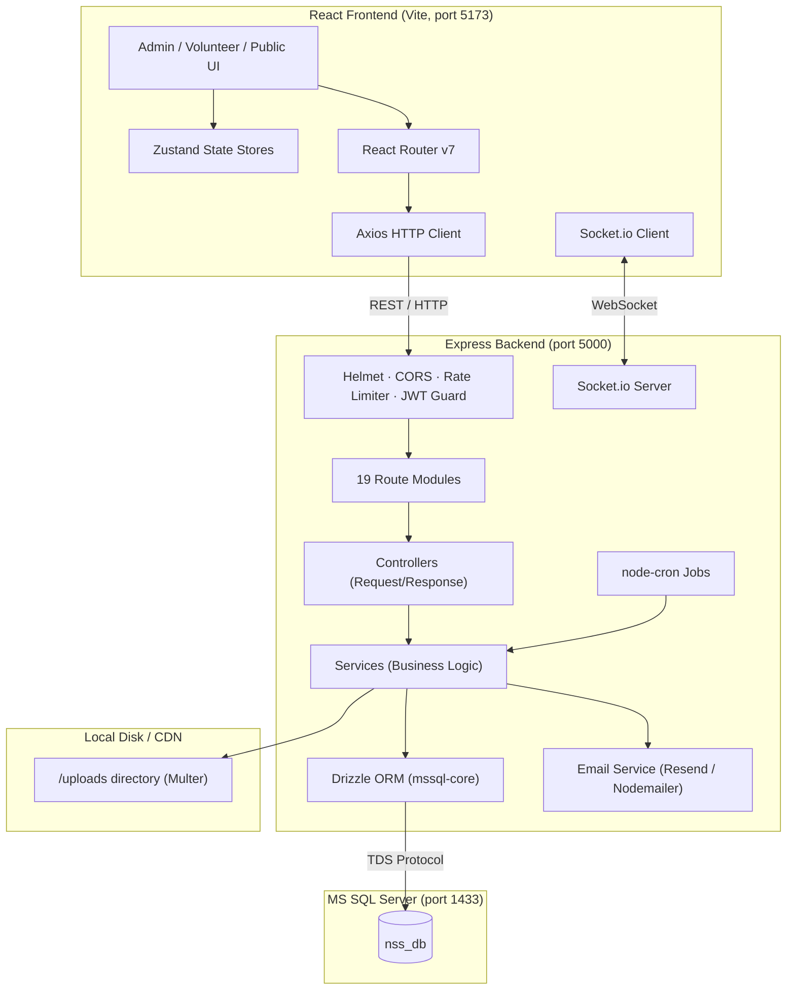

# NSS Website — JSPM RSCOE

> Created by **Bhagyesh Magar** for the love of the club.

A full-stack, production-grade web application for the **National Service Scheme (NSS)** club at JSPM Rajarshi Shahu College of Engineering (RSCOE). It operates as both a public-facing informational portal and a comprehensive administrative platform for managing volunteers, events, core teams, attendance, and academic year lifecycles.

---

## 📑 Table of Contents

1. [Tech Stack](#-tech-stack)
2. [Architecture Overview](#-architecture-overview)
3. [Database Schema](#-database-schema)
4. [API Reference](#-api-reference)
5. [Local Development Setup](#-local-development-setup)
6. [Environment Variables Reference](#-environment-variables-reference)
7. [Database Setup (MS SQL Server)](#-database-setup-ms-sql-server)
8. [Running & Testing](#-running--testing)
9. [Production Deployment](#-production-deployment)
10. [Project Structure](#-project-structure)
11. [Key Features & Design Decisions](#-key-features--design-decisions)
12. [Default Credentials](#-default-credentials)

---

## 🚀 Tech Stack

### Frontend (`client/`)

| Layer | Technology |
|---|---|
| Framework | React 19 + TypeScript |
| Build Tool | Vite 7 |
| Styling | Tailwind CSS 3 + Radix UI |
| Animations | Framer Motion + React Three Fiber (3D Hero) |
| State | Zustand 5 |
| Routing | React Router DOM v7 |
| HTTP Client | Axios |
| Charts | Recharts |
| Real-time | Socket.io-client |
| Excel Export | xlsx |
| Image Crop | react-cropper + cropperjs |
| Testing | Vitest + Playwright (E2E) |

### Backend (`server/`)

| Layer | Technology |
|---|---|
| Runtime | Node.js v20+ |
| Framework | Express 5 + TypeScript |
| Database | **Microsoft SQL Server 2019/2022** |
| ORM | Drizzle ORM (`drizzle-orm/mssql-core`) |
| Auth | JWT (`jsonwebtoken`) + bcryptjs |
| Validation | Zod 4 |
| Email | Resend + Nodemailer (Gmail fallback) |
| File Uploads | Multer (local disk storage) |
| Real-time | Socket.io |
| Background Jobs | node-cron |
| Security | Helmet + express-rate-limit |
| Testing | Vitest + Supertest |

---

## 🏗️ Architecture Overview



### Request Lifecycle

```
Browser → Axios → Express (Helmet → CORS → RateLimit) 
  → JWT Middleware (auth guard)
    → Router → Controller
      → Service (business logic + DB query via Drizzle)
        → MS SQL Server → Response
```

---

## 🗄️ Database Schema

The database is built on **MS SQL Server** and managed by **Drizzle ORM**. Since MS SQL has no native `ENUM` type, all enums are enforced as `NVARCHAR` columns with `CHECK` constraints at the database level AND `as const` arrays at the TypeScript level for compile-time safety.

### Tables Overview

| Table | Description |
|---|---|
| `admins` | Admin accounts with superadmin flag. Managed exclusively via seeder/backend. |
| `academic_years` | The central lifecycle entity. All NSS operations are scoped to an AY. |
| `activity_calendar` | Planned NSS activities for the year (Field Work, Health, Campus, National). |
| `volunteers` | Volunteer auth record. Scoped to an AY. Status: `regular` or `backup`. |
| `volunteer_profiles` | Extended volunteer profile (PRN, CGPA, caste, photo, etc.) — kept in a separate table from auth. |
| `core_team_roles` | Master reference of role definitions (seeded once). e.g., `department_coordinator`. |
| `core_team_assignments` | Per-AY assignment of volunteers (or external persons) to core team roles. |
| `special_camps` | Special NSS camps with a configurable `volunteer_cap`. |
| `special_camp_participants` | Snapshot participant records — frozen at finalization with `snap_*` columns. |
| `attendance_sessions` | An event/activity attendance session tied to an AY. |
| `attendance_records` | Individual volunteer attendance per session: `present`, `absent`, `late`. |
| `events` | NSS events (upcoming/past) shown on the public website. |
| `event_images` | Multiple images per event; one image is flagged as `is_master`. |
| `event_registrations` | Public registrations with approval workflow and auto-generated `visitor_pass_id`. |
| `gallery` | Media gallery with admin approval flow (`pending → approved/rejected`). |
| `site_settings` | Key-value table for runtime site configuration. |
| `audit_logs` | Append-only log of every critical admin action with JSON `details`. |
| `notifications` | Per-volunteer in-app notifications. |
| `meetings` | Core team meeting logs with attendance tracking. |
| `members` | Public-facing "About" page member records. |

### Academic Year State Machine

An Academic Year flows through exactly these states in order:

```
[Created] → (Activate) → [Active / isCurrent=1] → (Lock) → [Locked / isLocked=1] → (Archive) → [Archived / isArchived=1]
```

- Only **one** AY can be `isCurrent=1` at a time (enforced by a partial unique index).
- Locking an AY **blocks** all volunteer, core team, and camp mutations.
- Archiving an AY makes it fully read-only and hides it from the active management UI.
- Superadmins can unlock and unarchive AYs.

---

## 📡 API Reference

The backend exposes **19 route modules** all mounted under `/api`. The pattern is AY-scoped for core data:

### Academic Year Routes (`/api/academic-years`)
| Method | Endpoint | Description |
|---|---|---|
| `GET` | `/api/academic-years` | List all academic years |
| `POST` | `/api/academic-years` | Create a new AY |
| `GET` | `/api/academic-years/:id/stats` | Aggregated stats for an AY |
| `PATCH` | `/api/academic-years/:id/activate` | Set AY as current |
| `PATCH` | `/api/academic-years/:id/lock` | Lock an AY |
| `PATCH` | `/api/academic-years/:id/archive` | Archive a locked AY |

### AY-Scoped Volunteers (`/api/academic-years/:ayId/volunteers`)
| Method | Endpoint | Description |
|---|---|---|
| `GET` | `/` | List volunteers with filters (dept, status, search, isActive) + pagination |
| `POST` | `/` | Create a new volunteer in this AY |
| `GET` | `/:id` | Get a single volunteer with profile |
| `PATCH` | `/:id` | Update volunteer details |
| `DELETE` | `/:id` | Remove volunteer from AY |

### AY-Scoped Core Team (`/api/academic-years/:ayId/core-team`)
| Method | Endpoint | Description |
|---|---|---|
| `GET` | `/` | List all core team assignments for this AY |
| `POST` | `/` | Assign a volunteer to a role |
| `DELETE` | `/:id` | Remove an assignment |

### AY-Scoped Attendance (`/api/academic-years/:ayId/attendance`)
| Method | Endpoint | Description |
|---|---|---|
| `GET` | `/sessions` | List attendance sessions |
| `POST` | `/sessions` | Create a session |
| `GET` | `/sessions/:id/records` | Get all records for a session |
| `PUT` | `/sessions/:id/records` | Bulk-upsert attendance records |

### Other Key Routes
| Route Prefix | Description |
|---|---|
| `/api/auth` | Login, logout, password change for admins |
| `/api/volunteers/me` | Volunteer self-service (profile, password, notifications) |
| `/api/events` | Public & admin event CRUD |
| `/api/registrations` | Public event registration + visitor pass |
| `/api/gallery` | Media gallery with approval flow |
| `/api/audit-logs` | Admin-only audit log viewer |
| `/api/special-camps/:campId` | Camp CRUD, participants, finalize |
| `/api/academic-years/:ayId/meetings` | Core team meeting logs |
| `/api/upload` | File upload via Multer |

---

## 💻 Local Development Setup

### Prerequisites

| Requirement | Minimum Version | Notes |
|---|---|---|
| **Node.js** | v20.x | v25 also works |
| **npm** | v9+ | Comes with Node |
| **MS SQL Server** | 2019 / 2022 | Express Edition is free |
| **SQL Server Config Manager** | — | For enabling TCP/IP |

---

## 🔐 Environment Variables Reference

### `server/.env`

```env
# ── Database (MS SQL Server) ──────────────────────────────────────────────────
DB_SERVER=localhost                   # Hostname or IP. For named instances: localhost\SQLEXPRESS
DB_DATABASE=nss_db                    # The target database name
DB_USER=nss_app                       # SQL Server authentication username
DB_PASSWORD=NssAdmin123!              # SQL Server authentication password
DB_PORT=1433                          # Static port (must match SQL Server Config)

# ── App ───────────────────────────────────────────────────────────────────────
PORT=5000                             # Express server port
JWT_SECRET=your_very_long_secret_key  # Min 32 chars. Use a random string in production.
NODE_ENV=development                  # 'production' to disable Drizzle verbose logs

# ── Email (choose one) ────────────────────────────────────────────────────────
RESEND_API_KEY=re_xxxxxxxxxxxxxxxxxx  # Resend.com API key (recommended)
GMAIL_USER=you@gmail.com              # Gmail fallback
GMAIL_APP_PASSWORD=xxxx xxxx xxxx     # Gmail App Password (not your account password)

# ── Frontend URL ──────────────────────────────────────────────────────────────
CLIENT_URL=http://localhost:5173       # Used for CORS and email links
```

### `client/.env`

```env
VITE_API_URL=http://localhost:5000/api   # Points to the backend
```

> ⚠️ Never commit `.env` files. Both are already listed in `.gitignore`.

---

## 🗄️ Database Setup (MS SQL Server)

This section is the most critical part. Follow every step precisely.

### Step 1 — Install MS SQL Server

Download the **Developer** or **Express** edition (free) from Microsoft:
- https://www.microsoft.com/en-us/sql-server/sql-server-downloads

During installation, choose **"New SQL Server stand-alone installation"** and use the default **SQLEXPRESS** instance name.

Also install **SQL Server Management Studio (SSMS)**:
- https://learn.microsoft.com/en-us/sql/ssms/download-sql-server-management-studio-ssms

### Step 2 — Enable SQL Server Authentication Mode

By default, SQL Server only allows Windows Authentication. Node.js requires SQL Server Authentication.

1. Open **SSMS** and connect to `localhost\SQLEXPRESS` using Windows Authentication.
2. Right-click the server root → **Properties** → **Security** tab.
3. Under "Server authentication", select **"SQL Server and Windows Authentication mode"**.
4. Click **OK** and **restart the SQL Server service**.

### Step 3 — Enable TCP/IP on Port 1433

The Node.js `mssql` driver connects over TCP. Named instances use dynamic ports by default, which breaks connectivity.

1. Open **SQL Server Configuration Manager** (search in Start Menu).
2. Expand **SQL Server Network Configuration** → Click **Protocols for SQLEXPRESS**.
3. Right-click **TCP/IP** → **Enable**.
4. Right-click **TCP/IP** → **Properties** → go to the **IP Addresses** tab.
5. Scroll to the **IPAll** section at the bottom:
   - Set **TCP Dynamic Ports** to blank (delete any value).
   - Set **TCP Port** to `1433`.
6. Click **OK**.
7. Go to **SQL Server Services** → Right-click **SQL Server (SQLEXPRESS)** → **Restart**.

### Step 4 — Create the Database & Application User

Open a **New Query** in SSMS and run the following SQL:

```sql
-- 1. Create the database
CREATE DATABASE nss_db;
GO

-- 2. Switch to it
USE nss_db;
GO

-- 3. Create a SQL login (server-level)
CREATE LOGIN nss_app WITH PASSWORD = 'NssAdmin123!';
GO

-- 4. Create a user in this database mapped to that login
CREATE USER nss_app FOR LOGIN nss_app;
GO

-- 5. Grant db_owner so Drizzle can push schema (create/alter tables)
ALTER ROLE db_owner ADD MEMBER nss_app;
GO
```

> 💡 **Production Note**: For production, grant only the minimum permissions needed (`db_datareader`, `db_datawriter`, `db_ddladmin`) instead of `db_owner`.

### Step 5 — Push the Drizzle Schema

This command reads `server/src/db/schema.ts` and executes all `CREATE TABLE` statements against your database.

```bash
cd server
npm install
npm run db:push
```

You should see output like:
```
✓ Table `admins` created
✓ Table `academic_years` created
✓ Table `volunteers` created
... (all 18+ tables)
```

### Step 6 — Seed Initial Data

This populates the `core_team_roles` master data, a default `site_settings` record, and the **Superadmin** account.

```bash
npm run db:seed:all
```

Output should confirm:
```
✅ Core team roles seeded
✅ Site settings seeded  
✅ Superadmin account created
```

### Step 7 — Verify Connection

```bash
# Optionally, open Drizzle Studio (a browser-based DB viewer)
npm run db:studio
```

This opens a visual table browser at `https://local.drizzle.studio`.

---

## ▶️ Running & Testing

### Development

Run each in a **separate terminal**:

```bash
# Terminal 1 — Backend
cd server
npm run dev      # tsx watch src/index.ts → http://localhost:5000

# Terminal 2 — Frontend
cd client
npm run dev      # Vite dev server → http://localhost:5173
```

### Backend Unit Tests

```bash
cd server
npm test         # Vitest (one-shot)
npm run test:watch  # Vitest in watch mode
```

### Frontend E2E Tests

```bash
cd client
npm run test:e2e    # Playwright end-to-end tests
```

### Useful npm Scripts

| Command | Location | Action |
|---|---|---|
| `npm run db:push` | `server/` | Push Drizzle schema to DB (create/alter tables) |
| `npm run db:generate` | `server/` | Generate SQL migration files |
| `npm run db:migrate` | `server/` | Run pending migration files |
| `npm run db:studio` | `server/` | Open Drizzle Studio visual DB browser |
| `npm run db:seed:all` | `server/` | Seed roles, settings, and superadmin |
| `npm run build` | `server/` | Compile TypeScript → `dist/` |
| `npm run start` | `server/` | Run compiled JS (`node dist/index.js`) |
| `npm run build` | `client/` | Vite production build → `dist/` |
| `npm run preview` | `client/` | Serve the production build locally |

---

## 🚀 Production Deployment

### 1. Database — Recommended Options

| Option | Pros | Cons |
|---|---|---|
| **Azure SQL Database** | Fully managed, auto-backups, MS native | Costs money |
| **Amazon RDS for SQL Server** | Managed, VPC integration | Costs money |
| **Self-hosted VPS** (Windows Server + MSSQL) | Full control | You manage patching & backups |

For production, update `drizzle.config.ts` to disable `trustServerCertificate`:
```typescript
options: {
  trustServerCertificate: false,  // ← enforce TLS in production
  encrypt: true,
}
```

### 2. Backend — VPS with PM2

```bash
# 1. Clone repo on your server
git clone https://github.com/yourorg/nss-website.git
cd nss-website/server

# 2. Install dependencies
npm install

# 3. Create production .env
cp .env.example .env
nano .env  # fill in production values

# 4. Push schema to production DB
npm run db:push

# 5. Seed initial data (first time only)
npm run db:seed:all

# 6. Compile TypeScript
npm run build

# 7. Install PM2 globally
npm install -g pm2

# 8. Start the server
pm2 start dist/index.js --name "nss-backend"

# 9. Save PM2 config and enable auto-restart on server reboot
pm2 save
pm2 startup
```

#### Nginx Reverse Proxy for the Backend

```nginx
server {
    listen 80;
    server_name api.nssjspm.com;

    location / {
        proxy_pass http://localhost:5000;
        proxy_http_version 1.1;
        proxy_set_header Upgrade $http_upgrade;
        proxy_set_header Connection 'upgrade';   # Required for Socket.io
        proxy_set_header Host $host;
        proxy_set_header X-Real-IP $remote_addr;
        proxy_set_header X-Forwarded-For $proxy_add_x_forwarded_for;
        proxy_cache_bypass $http_upgrade;
    }
}
```

After setting up Nginx, secure with SSL:
```bash
sudo apt install certbot python3-certbot-nginx
sudo certbot --nginx -d api.nssjspm.com
```

### 3. Frontend — Static Hosting

#### Option A: Vercel / Netlify (Recommended — Free Tier)

1. Connect your GitHub repository to [Vercel](https://vercel.com) or [Netlify](https://netlify.com).
2. Set the **Root Directory** to `client`.
3. **Build Command**: `npm run build`
4. **Output Directory**: `dist`
5. Add environment variable: `VITE_API_URL=https://api.nssjspm.com/api`

#### Option B: VPS / Nginx Static File Server

```bash
# Build locally
cd client
VITE_API_URL=https://api.nssjspm.com/api npm run build

# Copy dist/ to your server
scp -r dist/* user@yourserver:/var/www/html/nss
```

Nginx config for the React SPA (must redirect all routes to `index.html`):

```nginx
server {
    listen 80;
    server_name nssjspm.com www.nssjspm.com;

    root /var/www/html/nss;
    index index.html;

    # Enable gzip compression
    gzip on;
    gzip_types text/plain text/css application/json application/javascript text/xml;

    # Cache static assets aggressively
    location ~* \.(js|css|png|jpg|jpeg|gif|ico|svg|woff2)$ {
        expires 1y;
        add_header Cache-Control "public, immutable";
    }

    # React Router — always fall back to index.html
    location / {
        try_files $uri $uri/ /index.html;
    }
}
```

#### Option C: Dockerized Deployment

```bash
# From the project root
docker-compose up --build -d
```

The `docker-compose.yml` orchestrates all services together.

---

## 📁 Project Structure

```text
nssrscoe/
│
├── client/                          # React Frontend (Vite)
│   ├── e2e/                         # Playwright E2E test specs
│   ├── public/                      # Static assets (favicon, PWA icons)
│   └── src/
│       ├── components/
│       │   ├── admin/               # Admin dashboard tab components
│       │   │   ├── AcademicYearsTab.tsx
│       │   │   ├── AttendanceTab.tsx
│       │   │   ├── CoreTeamTab.tsx
│       │   │   ├── VolunteersTab.tsx
│       │   │   ├── EventsTab.tsx
│       │   │   ├── GalleryTab.tsx
│       │   │   ├── SpecialCampsTab.tsx
│       │   │   ├── RegistrationsTab.tsx
│       │   │   ├── AuditLogTab.tsx
│       │   │   └── Shared.tsx       # Shared admin UI components (CapBar, AYStatusBadge, etc.)
│       │   ├── common/              # Shared page-level components
│       │   └── ui/                  # Low-level primitives (Lightbox, VisitorPass, etc.)
│       ├── pages/                   # Top-level route pages
│       ├── services/
│       │   └── api.ts               # Axios API client & all typed service functions
│       └── stores/                  # Zustand state stores
│
├── server/                          # Node.js + Express Backend
│   ├── drizzle/                     # Auto-generated Drizzle migration SQL files
│   ├── uploads/                     # Multer file upload storage (gitignored)
│   └── src/
│       ├── db/
│       │   ├── index.ts             # Drizzle client initialization (mssql connection)
│       │   └── schema.ts            # Complete DB schema — single source of truth
│       ├── controllers/             # Express request handlers (thin layer)
│       ├── services/                # Business logic & DB queries
│       │   ├── volunteerService.ts  # Complex volunteer queries with filtering/sorting
│       │   ├── academicYearService.ts # AY lifecycle + stats aggregation
│       │   ├── attendanceService.ts # Bulk attendance upsert + report generation
│       │   ├── coreTeamService.ts   # Role assignment with uniqueness enforcement
│       │   ├── specialCampService.ts # Camp management + participant snapshotting
│       │   ├── emailService.ts      # Resend/Nodemailer wrappers
│       │   ├── socketService.ts     # Socket.io initialization & room management
│       │   ├── cronService.ts       # Scheduled background jobs
│       │   └── auditService.ts      # Audit log writer
│       ├── routes/                  # Express router definitions (19 modules)
│       ├── middleware/
│       │   ├── auth.ts              # JWT verification middleware
│       │   ├── rateLimiter.ts       # express-rate-limit config
│       │   └── errorHandler.ts      # Centralized error handler
│       ├── lib/
│       │   ├── errors.ts            # Custom typed error classes
│       │   └── schemas/             # Zod validation schemas per domain
│       └── scripts/
│           ├── seedAll.ts           # Master seed script
│           └── seedCoreTeamRoles.ts # Core team role seeder
│
├── docker-compose.yml               # Container orchestration
└── .github/                         # CI/CD workflows
```

---

## ✨ Key Features & Design Decisions

### Academic Year Lifecycle
The entire platform is scoped to an **Academic Year (AY)**. This mirrors how NSS actually operates — each year has its own cohort of volunteers, core team, events, and camps. Data from previous years is preserved and read-only via the archive system.

### Volunteer Cap Enforcement
Each AY has a configurable `volunteerCap` (default: 100). Volunteers are either `regular` (counts toward cap) or `backup` (overflow list). The cap prevents over-enrollment and is enforced at the service layer.

### Participant Snapshotting for Special Camps
When a Special Camp is **finalized**, a point-in-time snapshot of each participant's profile is taken (stored in `snap_*` columns on `special_camp_participants`). This ensures that historical camp records remain accurate even if a volunteer's profile is later updated or deleted.

### RBAC (Role-Based Access Control)
Three tiers:
- **Superadmin** — Full access including AY locking/unlocking, admin management, and audit logs.
- **Admin (Core Team)** — Manages volunteers, events, attendance within the current AY.
- **Volunteer** — Self-service only (view own profile, update password, view notifications).

### Drizzle ORM on MS SQL
MS SQL has no `ENUM` type. All enumerated values use `NVARCHAR` + `CHECK` constraints at the DB level, backed by `as const` TypeScript arrays for type safety. The `drizzle-orm/mssql-core` dialect is used — **never mix with `drizzle-orm/pg-core`**.

### Audit Logging
Every significant admin action (creating volunteers, locking AYs, approving registrations) is written to `audit_logs` with a JSON `details` payload containing before/after context. This is append-only and never deleted.

---

## 🔑 Default Credentials

After running `npm run db:seed:all`:

| Role | Username | Password |
|---|---|---|
| Superadmin | `admin@nss.com` | `Admin@123` |

> ⚠️ Change these credentials immediately after first login in any environment that is not purely local.
